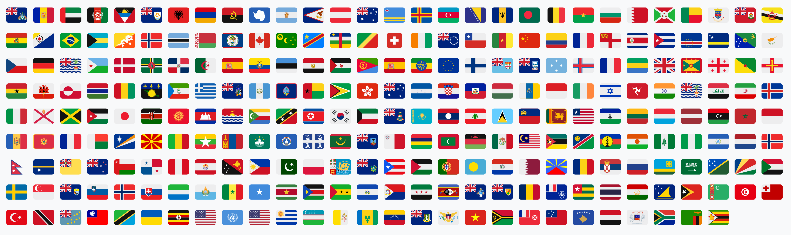

<h1 align="center">Add Country Flag Emojis to Windows 8-11</h1>

<div align="center">
  <p>
    <a href="https://github.com/Chasmical/flag-emojis-for-windows/releases">
      
    </a>
    <a href="https://github.com/Chasmical/flag-emojis-for-windows/subscription">
      
    </a>
    <a href="https://github.com/Chasmical/flag-emojis-for-windows/stargazers">
      
    </a>
    <a href="https://chsm.dev/blog/2025/09/23/bringing-flag-emojis-to-windows-11">
      
    </a>
  </p>
</div>

<h2 align="center">This font adds <b>country flag emojis</b> to Windows 11, while keeping all <b>Win11's original emojis</b>! 🇬🇧🧑‍💻🇯🇵😎🇰🇷💀🇨🇳🤖🇫🇷✨🇪🇸🐛🇮🇹</h2>


Unlike literally any other platform or OS, Windows never had flag emojis, and that always irked me a little bit. Having to guess what flag someone else is trying to send by just two letters isn't a great user experience, you know. And I always just kinda sighed at it, helplessly.

But not today... Today I woke up, and the absence of flag emojis in Windows has triggered me like never before, and so I've spent over 14 hours hyperfocused on this task of bringing flag emojis to Windows (without replacing *all* the emojis, that is, like some other projects did).

And now you too can say *"No!"* to Windows, *"I want the flag emojis that everyone else has!"*, [download and install this font](https://github.com/Chasmical/flag-emojis-for-windows/releases/latest/download/Segoe.UI.Emoji.with.Twemoji.Flags.ttf), restart your PC, and finally get to enjoy the full emoji experience on Windows!

&nbsp;

This font is based on Segoe UI Emoji v1.60 ([3D Fluent 16.0](https://emojipedia.org/microsoft-3D-fluent/fluent-16.0); Win11 25H2; 2025-08-29) and contains 258 flags from Twemoji v17.0.3 ([`jdecked/twemoji`](https://github.com/jdecked/twemoji)@[`b6b55fe`](https://github.com/jdecked/twemoji/commit/b6b55fef1e8636b540a6d016a4729ca8cdf2e60b) 2026-06-01). You can build it yourself, if you'd like (see the "How to build from scratch" section in the end).

## Major update v2.0.0 (6 Jul 2026)

- ✨ **Added support for COLRv0 rendering! Now works on Windows 8-10 too.**
- 💚 Now compiled with the emojis directly from [`jdecked/twemoji`](https://github.com/jdecked/twemoji) repository.
- ⚡️ Removed unnecessary SVG table, decreasing the font's size from 13.1 to 12.1 MB.
- 📏 Fixed the relative width and size of the emojis. Now they're the same size as others.

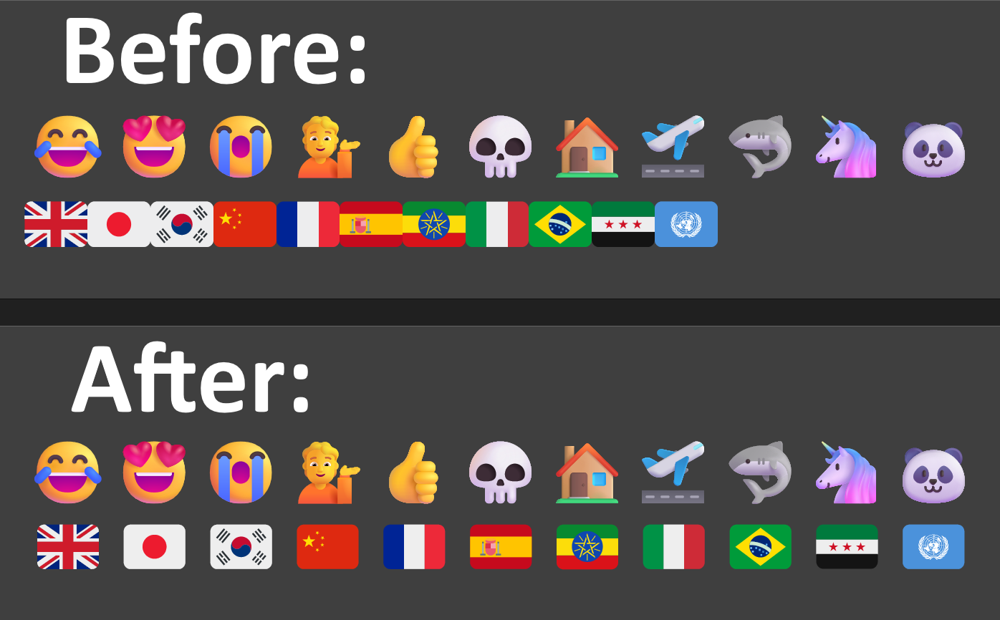


## Table of contents

1. [Installation](#installation)
2. [Screenshots](#screenshots)
3. [Similar projects & comparison](#similar-projects)
4. [How to build from scratch](#how-to-build-from-scratch)

Also, you can read [my blog post](https://chsm.dev/blog/2025/09/23/bringing-flag-emojis-to-windows-11)! *(a bit outdated now)*


## Installation

### [Download this font](https://github.com/Chasmical/flag-emojis-for-windows/releases/latest/download/Segoe.UI.Emoji.with.Twemoji.Flags.ttf) and install it ***for all users***.

### Restart your PC to apply changes.

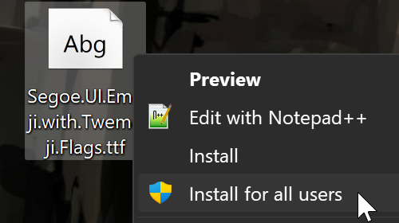

&nbsp;

Regular **"Install"** will only affect a few certain apps: Chromium-based browsers (Chrome, Opera, Vivaldi, etc), and Electron-based apps (Discord, VS Code, etc), so if that's enough for you, you can do this type of install.

**"Install for all users"** will attempt to render country flags in the system and many other apps too. Sometimes with mixed results though, since the system renders fonts inconsistently (more on that in the next section).


#### Uninstalling (if installed for all users)

Recover the original Segoe UI Emoji file: `Copy-Item "C:\Windows\Fonts\seguiemj.ttf"`, and install it for all users.

#### Uninstalling (if installed for current user)

Go to Settings > Personalization > Fonts, and find and select Segoe UI Emoji in the list. In the Metadata section, find the font file that you installed. Press the "Uninstall" button, and restart your PC.


## Screenshots

### It works perfectly in Chromium-based browsers (e.g. Vivaldi):

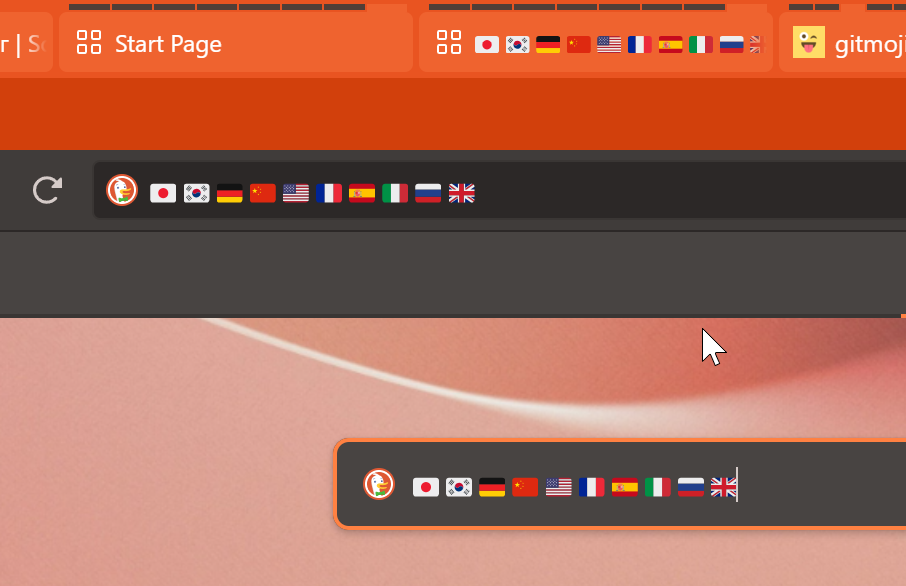

### As well as all Electron-based apps (VS Code, Discord, etc):

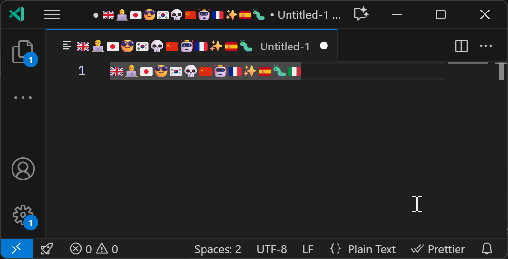

### And most non-system apps (e.g. Notepad++):

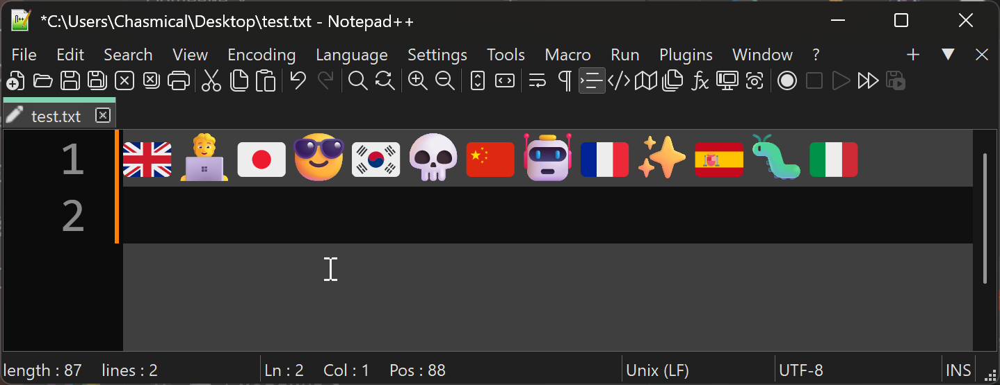

### It works in UWP apps too (most of modern system UI):

In a Microsoft Word document:

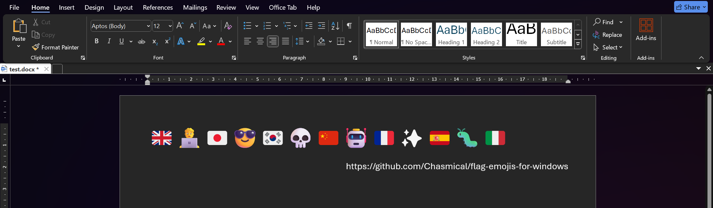

Fonts preview in "Settings > Personalizations > Fonts":

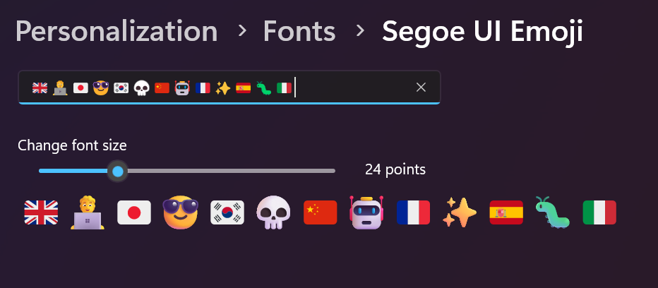

In the system Start menu:

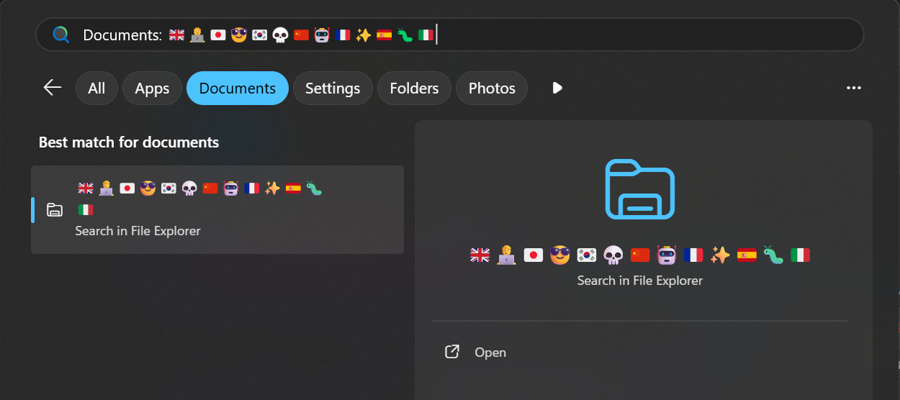

In the system task bar:

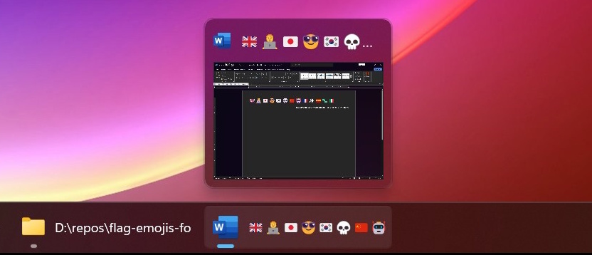

### System Limitations

Country flags are uncolored in the Explorer, but so are the rest of the emojis. It must be some sort of a limitation in the system itself, if it doesn't even color Windows's own original emojis.

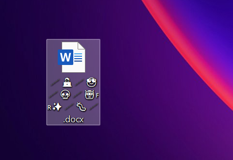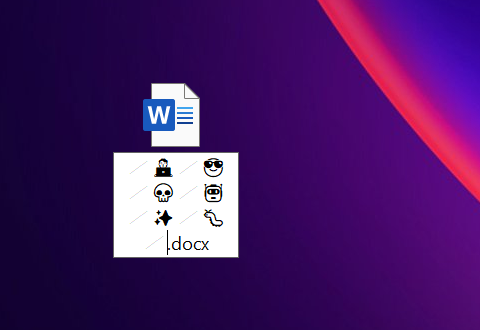

When the country flags appear invisible, you can see that the rest of emojis "downgrade" to lesser-quality versions. And when country flags are uncolored, the rest of emojis are uncolored too. So it's not something that **any** font can fix, — it's a limitation of the system itself. Maybe in future versions Windows will be able to render emojis consistently everywhere, but at the moment, it's the best that can be done.


## Similar projects

- [`perguto/Country-Flag-Emojis-for-Windows`](https://github.com/perguto/Country-Flag-Emojis-for-Windows) replaces Segoe UI Emoji with Google's Noto Color Emoji.

- [`quarrel/broken-flag-emojis-win11-twemoji`](https://github.com/quarrel/broken-flag-emojis-win11-twemoji) replaces Segoe UI Emoji with Twemoji emojis.

Here are the emojis that you get in all projects, for comparison:

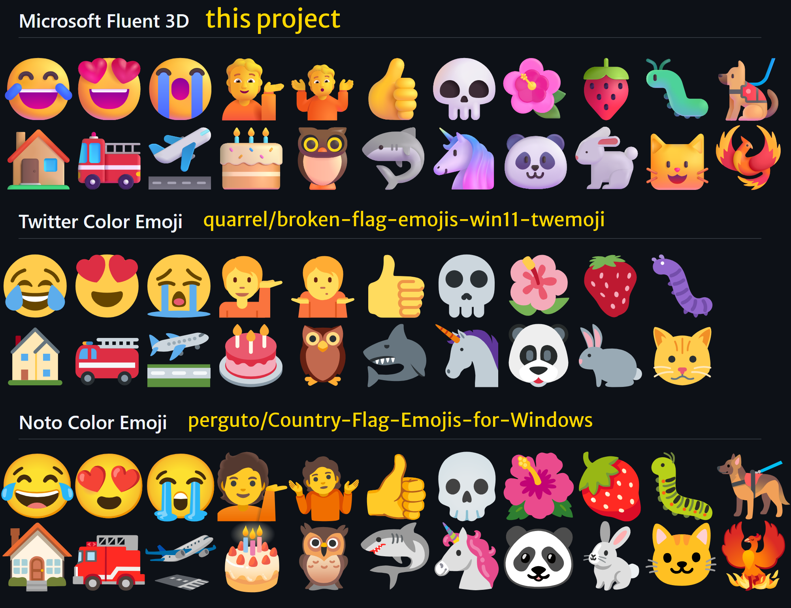

I personally prefer the original Fluent 3D set. A touch of 3D shading looks really nice and it brings some life to the emojis. Fluent 3D's people emojis have actual eyes, while others' have creepy dot eyes and blank stares. Also, as someone with entomophobia, Fluent 3D's bug emoji is the easiest to look at, and as a developer I have to look at it pretty often. And look at Fluent 3D's animals! So cute!

And here's a comparison of flags as well:

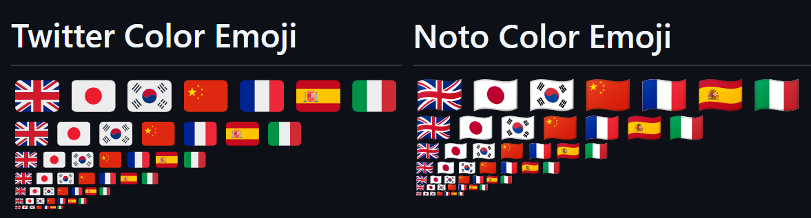

I decided to use Twitter's flag emojis, since Noto's wavy ones just look weird — straight lines become curves, circles become ovals, there's a weird gray glow around the flags, and they also don't downscale well.


## How to build from scratch

### Prerequisites

git, Python/pip, LINQPad (64x, not 32x!), 8-16 Gb of RAM, 1 Gb of disk space.

### Steps

1. First, install `fonttools` (with `lxml` feature) and `nanoemoji` using `pip`:

   ```sh
   pip install fonttools[lxml]
   pip install nanoemoji
   ```

   You might need to add `...\Python\Scripts` to PATH. `pip` should tell you if it's not there already.

2. Then clone the [`jdecked/twemoji`](https://github.com/jdecked/twemoji) repository, and copy the original Segoe UI Emoji font from your system's folder:

   ```sh
   git clone --no-checkout --depth=1 --filter=tree:0 https://github.com/jdecked/twemoji
   cd twemoji
   git sparse-checkout set --no-cone /assets/svg
   git checkout
   cd ..

   Copy-Item "C:\Windows\Fonts\seguiemj.ttf"
   ```

   When you install the new font, the original `seguiemj.ttf` should remain unchanged, so don't worry.

3. Open LINQPad, and run **[this script](./gen_flag_glyphs.cs)** to generate a list of flag glyph paths.

4. Now let's use `nanoemoji` to compile a COLRv0 font from the list of paths we just generated:

   ```sh
   nanoemoji --color_format glyf_colr_0 --upem 2048 --width 2812 `
     --transform "scale(1.666666) translate(-554.666666, 85.333333)" `
     $(Get-Content flag-glyphs.txt)

   Copy-Item build/Font.ttf twemoji.flags.ttf
   ```

   Segoe UI Emoji's units-per-em metric is 2048, and the its emojis' width is 2812. Some extra scaling and repositioning is also needed to make Twemoji's emojis fit in. The scale/translate parameters may not be perfect, I more or less just adjusted until it was good enough.

5. Now, let's "decompile" the fonts to XML:

   ```sh
   fonttools.exe ttx seguiemj.ttf
   fonttools.exe ttx twemoji.flags.ttf
   ```

   Decompiling Segoe UI Emoji might take about a minute, and the decompiled file will take up over 250 Mb of space. Twemoji's flags should decompile near-instantly and be tiny.

6. Then run **[this script](./gen_merged_font.cs)** in LINQPad:

   This is gonna use a lot of memory (about 2-4 Gb), but should finish pretty quickly (10-20s).

   Now there should be a ~280 Mb `merged.ttx` file in your working directory.

7. And finally, recompile the `merged.ttx` font file:

   ```sh
   fonttools.exe ttx merged.ttx
   ```

8. (optional) Test the font with `hb-view`:

   ```sh
   hb-view merged.ttf --output-file="merged.test.png" '🦄🐦‍🔥🏳️‍⚧️🇬🇧🏴󠁧󠁢󠁷󠁬󠁳󠁿🏳️‍⚧️'
   ```

9. And now just install the `merged.ttf` font, and everything should work!


### Notes

The scripts I wrote are a bit janky and disorganized, since I've had to try so many different things to finally get it to work... And they probably won't work with any other fonts, despite all my attempts to keep it as generic as possible. Feel free to fix it.

If you want to add emojis to Segoe UI Emoji from some other font, here's a list of resources that I found useful:

- [fontTools ttx](https://fonttools.readthedocs.io/en/latest/ttx.html) - can decompile TTF into a readable and editable XML, and recompiles it back losslessly.
- [OpenType's spec on Microsoft Learn](https://learn.microsoft.com/en-us/typography/opentype/spec/) explains the overall structure of a TTF file and its tables, and what different type ids mean, and etc.
- [GSUB docs on FontForge](https://fontforge.org/docs/techref/gposgsub.html) clarifies some stuff about substitution lookups.
- [HarfBuzz](https://harfbuzz.github.io/utilities.html#utilities-command-line-hbview) brought the project to the finish line! It not only renders font characters into the terminal, but also shows the entire textshaping process (run with option `-V`). I was stuck for a while on script and feature switches, not realizing that they disable rendering the ligatures in some places.


