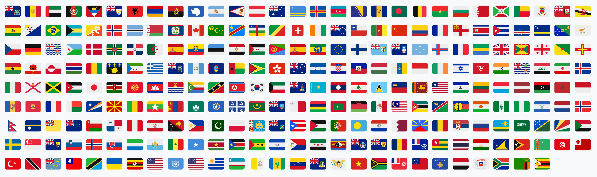

<h1 align="center">Add Country Flag Emojis to Windows 11</h1>

<div align="center">
  <p>
    <a href="https://github.com/Chasmical/flag-emojis-for-windows/releases">
      
    </a>
    <a href="https://github.com/Chasmical/flag-emojis-for-windows/subscription">
      
    </a>
    <a href="https://github.com/Chasmical/flag-emojis-for-windows/stargazers">
      
    </a>
  </p>
</div>

<h2 align="center">This font adds <b>country flag emojis</b> to Windows 11, while keeping all the <b>Win11's original emojis</b>! 🇯🇵 🇩🇪 🇨🇳 🇪🇸 🇬🇧 🎨🔥😭💀🥹✨</h2>


Unlike literally any other platform or OS, Windows never had flag emojis, and that always irked me a little bit. Having to guess what flag someone else is trying to send by just two letters isn't a great user experience, you know. And I always just kinda sighed at it, helplessly.

But not today... Today I woke up, and the absence of flag emojis in Windows has triggered me like never before, and so I've spent over 14 hours hyperfocused on this task of bringing flag emojis to Windows (without replacing *all* the emojis, that is, like some other projects did).

And now you too can say *"No!"* to Windows, *"I want the flag emojis that everyone else has!"*, download and install [this font](https://github.com/Chasmical/flag-emojis-for-windows/releases/download/v1.0.0/Segoe.UI.Emoji.with.Twemoji.flags.ttf), restart your PC, and finally get to enjoy the full emoji experience on Windows! Here's a quick test for after you install the font: 🇯🇵 🇰🇷 🇩🇪 🇨🇳 🇺🇸 🇫🇷 🇪🇸 🇮🇹 🇷🇺 🇬🇧.

&nbsp;

The font is based on whatever copy of Segoe UI Emoji I had on my PC. I've simply added to it 258 flags from [Twemoji](https://github.com/13rac1/twemoji-color-font) (the kind used on Twitter, Discord, etc) through the process detailed below.


## Installation

### [Download this font](https://github.com/Chasmical/flag-emojis-for-windows/releases/download/v1.0.0/Segoe.UI.Emoji.with.Twemoji.flags.ttf) and install it.

### Restart your PC to apply changes.

&nbsp;

#### Uninstalling

Go to Settings > Personalization > Fonts, and find and select Segoe UI Emoji in the list. In the Metadata section, find the font file that you installed. Press the "Uninstall" button, and restart your PC.


## How to build from scratch

### Prerequisites

git, Python/pip, LINQPad (64x, not 32x!), 8-16 Gb of RAM, 1 Gb of disk space.

### Steps

1. First, copy the original Segoe UI Emoji font from your system's folder:

   ```ps1
   Copy-Item "C:\Windows\Fonts\seguiemj.ttf"
   ```

   When you install the new font, the one in `C:\Windows\Fonts` should remain unchanged, but we'll back it up just in case.

2. Download the [16.0.1 Twemoji font](https://github.com/quarrel/broken-flag-emojis-win11-twemoji/blob/main/Twemoji-16.0.1-SVG-COLR1.ttf) (from [quarrel/broken-flag-emojis-win11-twemoji](https://github.com/quarrel/broken-flag-emojis-win11-twemoji) repository), and put it in your working directory:

   ```ps1
   Invoke-WebRequest -Uri "https://github.com/quarrel/broken-flag-emojis-win11-twemoji/raw/refs/heads/main/Twemoji-16.0.1-SVG-COLR1.ttf" -OutFile twemoji.ttf
   ```

3. Clone the [`13rac1/twemoji-color-font`](https://github.com/13rac1/twemoji-color-font) repository:

   ```sh
   git clone https://github.com/13rac1/twemoji-color-font
   ```

4. Open LINQPad, and run **[this script](./gen_flag_glyphs.cs)** to generate a list of glyphs:

   That will generate a file with all the glyphs we need (regional indicator symbols U+1F1E6-1F1FF, as well as all their combinations that have a defined flag glyph). It will be used to subset the Twemoji font.

5. Install `fonttools` (with `lxml` feature) using `pip`:

   ```sh
   pip install fonttools[lxml]
   ```

   You might need to add `...\Python\Scripts` to PATH. `pip` should tell you if it's not there already.

6. Subset the Twemoji font using the glyphs file we generated:

   ```sh
   fonttools.exe subset twemoji.ttf --glyphs-file=flags-glyphs.txt
   ```

   `WARNING: FFTM NOT subset; don't know how to subset; dropped` is normal.

   That should create a `twemoji.subset.ttf` file in your working directory.

7. Now, let's "decompile" the fonts to XML:
   
   ```sh
   fonttools.exe ttx seguiemj.ttf
   fonttools.exe ttx twemoji.subset.ttf
   ```

   Decompiling Segoe UI Emoji might take about a minute, and the decompiled file will take up over 250 Mb of space. Twemoji's subset should decompile much quicker, and take up a little below 10 Mb.

8. Then run **[this script](./gen_merged_font.cs)** in LINQPad:

   This is gonna use a lot of memory (about 8 Gb), but should finish pretty quickly (10-20s).

   Now there should be a ~300 Mb `merged.ttx` file in your working directory.

9. And finally, recompile the `merged.ttx` font file:

   ```sh
   fonttools.exe ttx merged.ttx
   ```

10. And now just install the `merged.ttf` font, and everything should work!


### Notes

The scripts I wrote are a bit janky and disorganized, since I've had to try so many different things to finally get it to work... And they probably won't work with any other fonts, despite all my attempts to keep it as generic as possible. Feel free to fix it.

If you want to add emojis to Segoe UI Emoji from some other font, here's a list of resources that I found useful:

- [fontTools ttx](https://fonttools.readthedocs.io/en/latest/ttx.html) - can decompile TTF into a readable and editable XML, and recompiles it back losslessly.
- [OpenType's spec on Microsoft Learn](https://learn.microsoft.com/en-us/typography/opentype/spec/) explains the overall structure of a TTF file and its tables, and what different type ids mean, and etc.
- [GSUB docs on FontForge](https://fontforge.org/docs/techref/gposgsub.html) clarifies some stuff about substitution lookups.
- [HarfBuzz](https://harfbuzz.github.io/utilities.html#utilities-command-line-hbview) brought the project to the finish line! It not only renders font characters into the terminal, but also shows the entire textshaping process (run with option `-V`). I was stuck for a while on script and feature switches, not realizing that they disable rendering the ligatures in some places.


### Similar projects

- [`perguto/Country-Flag-Emojis-for-Windows`](https://github.com/perguto/Country-Flag-Emojis-for-Windows) completely replaces Segoe UI Emoji with Google's Noto Color Emoji.

- [`quarrel/broken-flag-emojis-win11-twemoji`](https://github.com/quarrel/broken-flag-emojis-win11-twemoji) completely replaces Segoe UI Emoji with Twemoji emojis.


